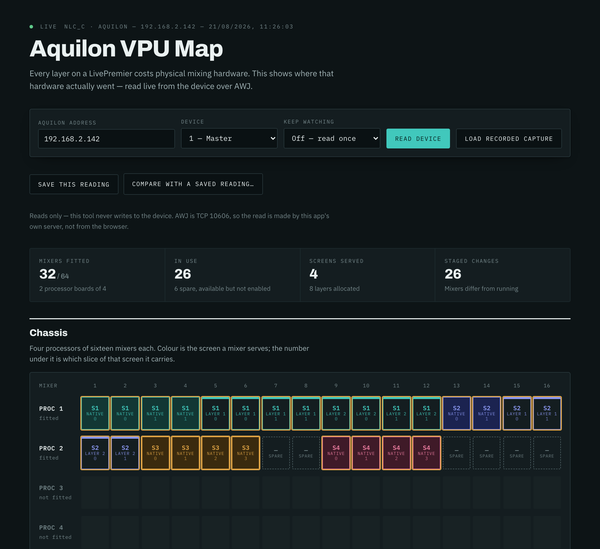
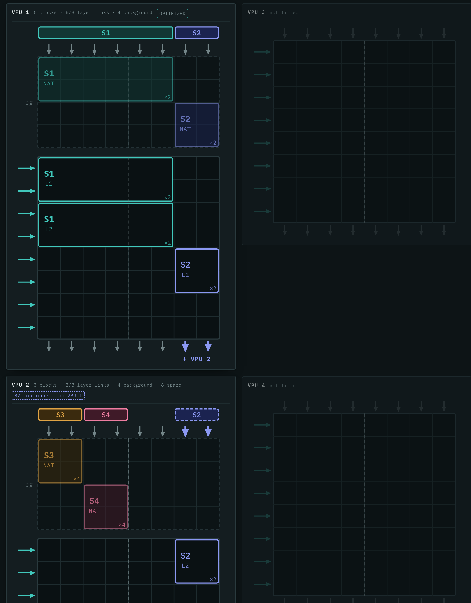

# Aquilon VPU Map

> **AI-assisted project.** This codebase was created with [Claude](https://claude.com/claude-code)
> (Anthropic), directed and reviewed by a human author. **It has read a real Aquilon C
> end to end** — 32 of 64 mixers fitted, 28 in use, in about 750 ms — and the recorded
> capture, the tests and the screenshots all come from that device. Still untested:
> **Link** setups (devices 2–4), capabilities other than `4K`, combined VPUs, Optimized
> mode and Cut & Fill, none of which that chassis uses.

See how an Analog Way **LivePremier** allocates its VPU mixers across screens, layers
and slices.

Every layer on a LivePremier costs physical mixing hardware. The device knows exactly
where that hardware went and will tell you — but the stock Web RCS shows it a panel at
a time. This puts the whole chassis on one screen.



## The link grid



The manual draws a VPU as an **8×8 field of links** — eight layer links in from the
left, eight output links out through the top and bottom (User Manual v6.0 §5.5). A
layer occupies a square block sized by its capacity: capacity 1 is 1×1 links,
capacity 2 is 2×2, capacity 4 is 4×4. So one VPU holds 64 capacity-1 layers, 16
capacity-2 ones, or 4 capacity-4 ones.

A VPU spreads a layer over at most **4 output links**; a layer wider than that takes
a second layer link and wraps onto it (§5.5.4), which the view marks with the
manual's hook. A screen needing more than 8 outputs spills into another VPU (§5.5.5).

> **Columns are the device's own; rows are derived.**
>
> Each mixer reports `usedOnOutPipe1..8` — exactly which output links it drives — so
> horizontal position is real. It is also not what you would guess: runs are
> **interleaved**, not contiguous. On the captured Aquilon C, S1 sits on links 1 and 3,
> S3 on 2 and 4, S2 on 5 and 7.
>
> Nothing names the layer link, though. Two layers of one screen share both their output
> links *and* their slice numbers — S4's native and its layer 1 are identical on both —
> so rows are packed: one row per slice, starting at the first row where the run's
> columns are free. Runs on separate links share rows; runs that collide stack.
>
> `$vpuLayer`, which looked like the reported grid, **does not exist on hardware** — it
> answers `E12`, as does `$pipe`. Both are present but permanently empty on the
> simulator. See [docs/HARDWARE-PROBE.md](docs/HARDWARE-PROBE.md).

## What a VPU mixer is

A **VPU mixer** is the physical mixing and scaling resource the device allocates to a
(screen, layer) pair. An Aquilon has up to four processors of sixteen mixers — **64**
in total, though most chassis are part-populated.

A layer too wide for a single mixer is split across several, each carrying one
**slice**. That is why an eight-slice background can consume an entire processor board
on its own, and why counting layers never tells you whether a configuration will fit.

The device reports the map read-only, and keeps two copies of it: `current` (running)
and `new` (staged). This tool shows the running map and highlights anything the staged
one would change.

## Running it

```bash
npm start
```

Then open <http://localhost:8531> and enter your Aquilon's address.

```bash
PORT=9000 AQUILON_IP=192.168.1.50 npm start
```

`AQUILON_IP` only sets the address the form starts on; the field is editable and the
last address you used is remembered in the browser.

### Docker

```bash
docker compose up -d
```

## Why it needs a server

AWJ is a raw TCP protocol on port **10606**. A browser tab cannot open a TCP socket, so
the page cannot talk to the device directly however it is hosted. This app's own server
makes the read and hands back JSON.

That is also why there is no useful "just open the HTML file" mode: without the server
you get the recorded capture and nothing else.

## Reads only

This tool **never writes to the device**. It issues AWJ `get` and nothing else — not
even the `Subscriptions` write that a push-based client would need. Every property it
reads is declared `readOnly` in the device's own model, so there is no state here that
could be changed by accident.

If you want to be sure, `lib/awj.js` has no code path that emits `replace`.

## The recorded capture

`data/aquilon-c-snapshot.json` is a real read from a real Aquilon C — 32 of 64 mixers
fitted, 28 in use across four screens. **Load recorded capture** shows it, which is
useful for seeing what the tool does without a device in front of you, and it is what
the test suite asserts against.

The host it came from is redacted; nothing else is edited.

## Supported devices

Built for **LivePremier** (Aquilon). AWJ is also spoken by Alta 4K and Midra 4K, and
the client here will connect to them, but the VPU mixer map is a LivePremier structure
and other platforms answer `E12` for it — the app says so plainly rather than showing
an empty chassis.

**The LivePremier simulator has no VPU map.** The path resolves as far as
`$device/@items/1` and then stops. This is not a bug in the tool; the simulator has no
processor boards to map.

The simulator and real hardware do not expose the same collections at all. Hardware has
`vpuMixerList` and neither `pipeList` nor `vpuLayerList`; the simulator has exactly the
opposite. Anything checked only against the simulator should be re-checked on a device.

## Paths

Firmware 6.2, verified on hardware. The collection segment is `$vpuMixer`, camelCase —
`$vpu-mixer` and `$mixer` both answer `E12`.

```
DeviceObject/preconfig/resources/{current|new}/status/mapping
  /$device/@items/<1-4>                       1 = master, 2-4 = Link followers
  /$vpuMixer/@items/PROC_<1-4>_MIXER_<1-16>
    /@props/isAvailable                       fitted?
    /@props/isEnabled                         in use?
    /@props/usedInScreen                      S1..S24
    /@props/usedInLayer                       NATIVE, then 1..256
    /@props/slice                             0..8
    /@props/capability                        OFF DUAL 4K 3 5K 5 6 7 8K
    /@props/channel                           0 on every mixer seen so far;
                                              assumed to index the Link device
    /@props/seamlessCapa
    /@props/cutnfillCapa                      OFF, or the capability it doubles
    /mixerAllocation/@props/usedOnOutPipe{1-8} which output link, NONE..64
    /$scaler/@items/{A,B}/@props/{memoryFill,memoryCut}  SM1..SM8
```

AWJ cannot enumerate: every container read returns `{}`. See [AGENTS.md](AGENTS.md) for
where the model came from and how to recover the rest of it.

## Profiling your own device

If you have a LivePremier, a profile of how *your* box has allocated its VPU mixers is
genuinely useful — the model here was built from one Aquilon C, and every configuration
that differs from it teaches something.

```bash
node scripts/profile-vpu.mjs 192.168.1.50 --note "Aquilon RS4, 3 screens"
```

One file, no dependencies, Node 18+. **It only reads.** There is a single line in it
that sends anything to the device and it is hard-coded to AWJ's `get` verb; the script
says so at the top and invites you to check. It takes about five seconds and is safe on
a live system, though you may as well run it between shows.

It writes `vpu-profile-<model>-<timestamp>.json` and prints a summary. The file records
structure only — screens appear as `S1`..`S24` and mixers as `PROC_n_MIXER_n`. **No
addresses, serial numbers, device names, screen names or labels**, so there is nothing
in it that identifies you, your client or your show. Read it, then attach it to an
issue if you are happy to share.

Most valuable are configurations unlike the one already recorded: mixed capabilities
(`DUAL`, `8K`), **Link** setups with more than one device, Cut & Fill, Optimized mode,
or a screen spread over more than 8 outputs. The script tells you which of these your
box shows.

## Probing hardware

```bash
node scripts/probe-hardware.mjs <ip> --out probe-out
```

Read-only. Captures the device's whole `preconfig/resources` subtree, sweeps for
paths this tool does not yet use, and reports whether the `$vpuLayer` link grid is
populated. See [docs/HARDWARE-PROBE.md](docs/HARDWARE-PROBE.md).

## Tests

```bash
npm test
```

No dependencies, no build step. Node 18+.

## Licence

MIT — see [LICENSE](LICENSE).

Not affiliated with Analog Way. "LivePremier", "Aquilon" and "Alta" are their marks.
